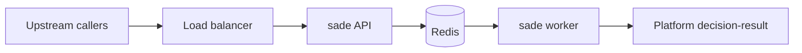

# SADE deployment (one-pager)

Handoff for platform / architecture: what to run, how traffic flows, and which configuration is required in AWS (or similar).

## What this service does

- **Ingest:** `POST /decision-request` — accepts a **merged entry-request JSON** (evaluation IDs, zone, pilot, UAV, weather, reputation, claims, etc.).
- **Processing:** LLM orchestration runs in the **worker** when **`REDIS_URL`** is set (recommended for production); the API enqueues to Redis and returns **202** quickly.
- **Outbound:** Completed evaluations are **`POST`ed to `DECISION_RESULT_URL`** (full URL, including path, e.g. `https://…/decision-result`). Per-request callback fields in the body are **not** used; configure one URL in the environment.



## Container image

- **Single image** for both processes: build from repo root with [`docker/Dockerfile`](../docker/Dockerfile).
- **Build:** `docker build -f docker/Dockerfile -t <registry>/sade:<tag> .`
- **Push** to ECR (or your registry), then reference the same image in **two** task definitions / deployments.

| Role | Command | Listens |
|------|---------|--------|
| **API** | `uvicorn sade.api:app --host 0.0.0.0 --port 8000` | **8000** (place behind ALB/NLB) |
| **Worker** | `python -m sade.decision_worker` | No HTTP (scale on queue depth / CPU) |

## Infrastructure dependencies

- **Redis** (ElastiCache or self-managed): **required** for the queued path. Both API and worker need the same **`REDIS_URL`** (TLS URL if your provider requires it).
- **OpenAI**: orchestration calls OpenAI; **`OPENAI_API_KEY`** must be set on **worker** (and on API if you ever run **without** Redis in-process).

## Required environment variables

| Variable | Where | Purpose |
|----------|--------|---------|
| `REDIS_URL` | API + worker | Queue connection, e.g. `rediss://…` or `redis://…` |
| `OPENAI_API_KEY` | Worker (and API if in-process mode) | LLM calls |
| `DECISION_RESULT_URL` | **Worker** (required for callbacks in Redis mode) | `POST` completed evaluation JSON here |
| `DECISION_RESULT_URL` | API | Only if API runs jobs **without** Redis (not typical in prod) |

Optional:

| Variable | Purpose |
|----------|---------|
| `SADE_INGEST_API_KEY` or `SADE_INGEST_API_KEYS` | If set, `POST /decision-request` requires `X-API-Key` or `Authorization: Bearer` |
| `SADE_INGEST_REVOKED_KEYS` | Comma-separated keys that must receive 403 |
| `SADE_PERSIST_RESULTS` | Set `0` to disable writing `results/api-integration/` on disk |

Template: [`.env.example`](../.env.example). **Do not** commit real secrets; use Secrets Manager / SSM / ECS secrets.

## Health checks

- **API:** HTTP **GET** `http://<task-ip>:8000/openapi.json` (returns 200 if the app is up).
- **Worker:** No HTTP endpoint; rely on ECS task health (process running) or observability on the Redis consumer group.

## Network

- ALB/target group → **port 8000** on the API service only.
- Redis and worker should live in a **private** network reachable from both API and worker tasks; **do not** expose Redis publicly.

## Local smoke test

```bash
cp .env.example .env
docker compose up --build
# POST http://localhost:8000/decision-request
```

Details: [`docker/README.md`](../docker/README.md), [`README.md`](../README.md) (Docker section).
